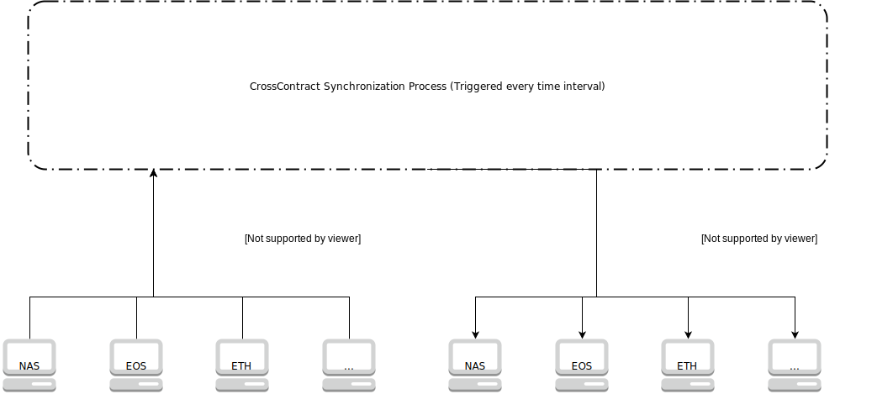

# Project: Voyager(CrossChainSynchronization)
## About
Project Voyager is a project which provide the cross chain synchronization between different Chain. This will provide consensus on different decentralized projects. We see many chain raised ETH for cross chain project but do not see many convinient cross chain solutions. That why we start Project Voyager. We build a MVP which do cross chain synchronization between NAS and ETH. We hope more developers will join us and make Voyager more powerful!

## Overview
The CrossChainSynchronization is a stateless process to synchonize the contents between Genesis contracts on differnt chains. 
For example, let's say we have 2 Genesis contracts on Nebulas and ETH.

In Nebulas Genesis contract, we have 2 characters:

    nasCharacter1, // the id is nasID1
    nasCharacter2  // the id is nasID2
    
In ETH Genesis contract, we have 1 character:

    ethCharacter1 // the id is ethID1

After the synchronization,  we expect both contracs has the same content, which is

    nasCharacter1, // the id is nasID1
    nasCharacter2, // the id is nasID2
    ethCharacter1  // the id is ethID1
    
The InterChainSynchronization code is open-sourced and is triggered every certain time interval by a (IPFS?) server. 
    
## High Level Design

The process of CrossChainSynchronization can has 2 steps:
1. get the IDs of the characters to be synchronized of each contracts from the `<Contract>.newlyAddedIDs`, which are the newly added IDs since last synchronization. 
For instance, following are the IDs to be synchronized:

```javascript
    {
      "NAS": [nasID1, nasID2],
      "ETH": [ethID1]
    }
```

2. For each ID of each contract, we add the corresponding character to all other contracts. 
If the character is successfully adde to all other contracts, we can safely remove the ID from `<Contract>.newlyAddedIDs`,
otherwise the ID will be retried in the next InterChainSynchronization process.

## Vision

We hope Project: Voyager can do cross chain synchronization between hundreds different blockchain. We also hope Project Voyager will bring convinience for more DApp developers!


